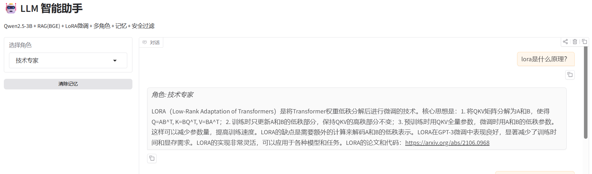
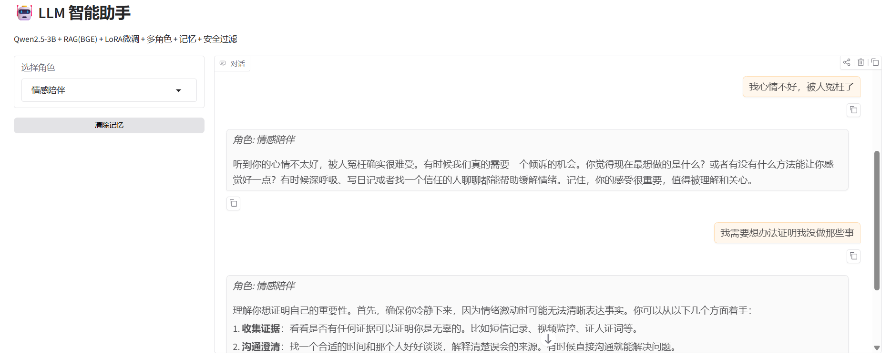
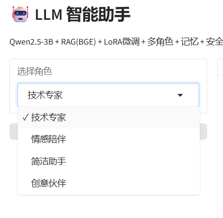
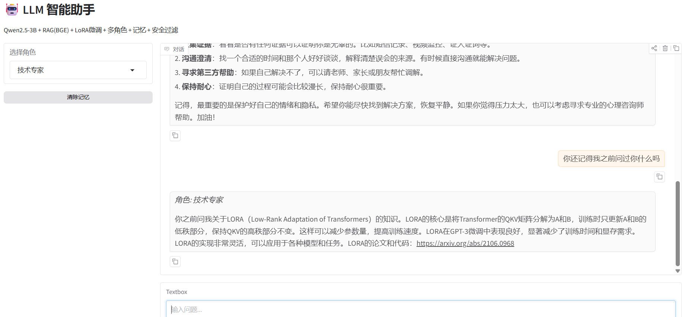

# 🤖 LLM 智能助手

[](https://www.python.org/)
[](https://pytorch.org/)
[](https://huggingface.co/Qwen)
[](https://huggingface.co/BAAI/bge-small-zh-v1.5)

> 基于 **Qwen2.5-3B + RAG + LoRA 微调** 的本地智能对话系统  
> 支持多角色切换、多轮记忆、内容安全过滤 | RTX 4070 Laptop (8GB) 全本地运行

## 📸 效果演示

| RAG 检索 + 技术问答 | 情感陪伴 + 多轮对话 |
|---|---|
|  |  |

| 人设切换（四角色） | 对话记忆（追问验证） |
|---|---|
|  |  |

## ✨ 功能特性

- **RAG 检索增强**：BGE-small-zh 嵌入 + 混合检索（语义+关键词），知识库问答
- **LoRA 参数微调**：0.5% 可训练参数，68MB 权重，推理速度无损耗
- **多角色切换**：技术专家 / 情感陪伴 / 简洁助手 / 创意伙伴
- **多轮对话记忆**：滑动窗口上下文管理，长对话不丢失信息
- **内容安全过滤**：输入输出双检，敏感内容自动拦截
- **全本地运行**：无需 API Key，GPU 推理，隐私数据不出机

## 🏗️ 技术架构

```
用户输入
  ├── 安全检测（输入过滤）
  ├── 对话记忆（历史上下文）
  ├── BGE 向量检索 → ChromaDB（知识库）
  ├── Prompt 构造（人设 + 检索结果 + 记忆）
  └── Qwen2.5-3B + LoRA → 生成回答
       └── 安全检测（输出过滤）
```

## 📁 项目结构

```
llm_interview_assistant/
├── data/
│   ├── knowledge/              # RAG 知识库文档
│   ├── sft_train.json          # LoRA 微调训练数据
│   └── personas.json           # 四套人设 System Prompt
├── src/
│   ├── app.py                  # Gradio 网页主程序（多角色+记忆+安全）
│   ├── build_kb.py             # 知识库构建（BGE 嵌入 + ChromaDB）
│   ├── rag_pipeline.py         # RAG 核心管线
│   ├── sft_train.py            # LoRA 微调脚本
│   ├── benchmark.py            # 微调前后量化对比
│   ├── rag_langchain.py        # LangChain 版 RAG（框架对比）
│   ├── memory.py               # 对话记忆模块
│   └── safety.py               # 内容安全过滤
├── requirements.txt
└── README.md
```

## 🚀 快速开始

### 环境要求
- Python 3.12 + CUDA 12.8
- NVIDIA GPU (8GB+ VRAM)
- 已下载 Qwen2.5-3B-Instruct (ModelScope)

### 1. 安装依赖
```bash
pip install -r requirements.txt
```

### 2. 构建知识库
```bash
cd src
python build_kb.py
```
10 秒完成——BGE-small-zh 嵌入向量化 + ChromaDB 存储。

### 3. LoRA 微调（可选）
```bash
python sft_train.py
```
18 条技术问答对，5 epoch，约 5-10 分钟。产出 68MB LoRA 权重。

### 4. 微调效果对比（可选）
```bash
python benchmark.py
```
8 题量化对比基座 vs 微调模型，输出 JSON 数据。

### 5. 启动服务
```bash
python app.py
```
浏览器自动打开 `http://127.0.0.1:7860`

## 🎮 使用说明

| 角色 | 适用场景 | 示例 |
|---|---|---|
| 技术专家 | 技术问答、原理解释 | "LoRA 的原理是什么" |
| 情感陪伴 | 倾诉、聊天、情感支持 | "我今天心情不好" |
| 简洁助手 | 快速查答案 | "Transformer 和 BERT 区别" |
| 创意伙伴 | 头脑风暴、多角度思考 | "怎么学好大模型" |

切换角色后，模型的回答风格和语气会随之改变。对话记忆最多保留 10 轮。

## 📊 模型性能

| 指标 | 数值 |
|---|---|
| 基座模型 | Qwen2.5-3B-Instruct |
| 嵌入模型 | BAAI/bge-small-zh-v1.5 (24MB) |
| LoRA 可训练参数 | 0.5% |
| LoRA 权重大小 | 68.1 MB |
| 单次推理耗时 | 3-10 秒 |
| GPU 显存占用 | ~6.5GB |
| 知识库检索命中率 | 100%（6 篇文档 × 12 块） |

## 🔧 技术栈

**模型**: Qwen2.5-3B-Instruct · **嵌入**: BGE-small-zh · **向量库**: ChromaDB · **微调**: LoRA (PEFT) · **界面**: Gradio · **框架**: LangChain · **硬件**: RTX 4070 Laptop (8GB)
